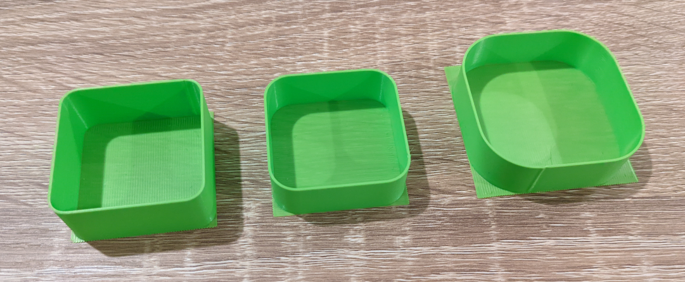

# Flow calibration

## Description

A lot of different method exist to measure and calibrate the flow but none of them is really consistent: most of the time, the results are ambigous and open to interpretation and also always dependant of the slicer profile used. The main reason for this calibration macro is to get a filament and slicer agnostic way to calibrate the flow extrusion multiplier using simple measuring tools. The goal is to make it easy to set, share and use it.



This macro is parametric and most of the values can be adjusted with their respective input parameters. It's working in two phases:
  1. First, you call the `FLOW_MULTIPLIER_CALIBRATION` macro to print an hollow shell with a known number of perimeters based on the [Slic3rPE flow math](https://manual.slic3r.org/advanced/flow-math). The macro also print in the Fluidd/Mainsail console the theorical shell thickness that you should measure.
  2. Then, when the print end, you need to measure the shell average thickness using a micrometer or a good caliper) and input it in the second macro `COMPUTE_FLOW_MULTIPLIER MEASURED_THICKNESS=xxx.xxx`. The new calibrated flow is automatically printed in the Fluidd/Mainsail console.


## Installation

If you installed and use the full config folder of this github repository, this is already enabled by default and should work out of the box.

If you want to install it to your own custom config, here is the way to go:
  1. Copy the [calibrate_flow.cfg](./../../macros/calibration/calibrate_flow.cfg) macro file directly into your own config.
  2. **IMPORTANT STEP**: Add and activate (if not already the case) a `[gcode_arcs]` section in your config as it's used for the round corners. Don't hesitate to change the resolution to something like 0.1 or 0.2 to get a better surface finish in the corner radius.


## Usage

First, make sure your axis are homed, your bed mesh is loaded (if you are using one), both the hotend and the bed are at the temperature required for your filament and the machine is ready to print something. Don't forget to do the QGL, Z-tilt, set your Z offset correctly, ... Basically you can call your `PRINT_START` manually or replicate all the required steps.

Then, start the print by typing in the klipper console (using Mainsail/Fluidd/Octoprint) the following macro call:

```
FLOW_MULTIPLIER_CALIBRATION [with the needed args...]
```

Regarding the parameters availables when calling the `FLOW_MULTIPLIER_CALIBRATION` macro, please see this table:

| parameters | default value | description |
|-----------:|---------------|-------------|
|DO_RAFT|1|print a "base" to support the shell (better bed adhesion and easier to remove at the end)|
|DO_RETRACT|0|enable/disable retraction. Disabled by default to try to keep a constant flow, but can be enabled in case of problems on the print|
|PRINT_SIZE|40|size in mm, that the test will use on the bed. The model will be printed in the middle of the bed|
|HEIGHT|15|height in mm of the printed shell|
|CORNER_RADIUS|8|external radius used in the corners of the shell to smooth the velocity and try to keep a constant flow over the print|
|PERIMETERS|2|number of perimeters used to print the shell. If using 1 perim, it's mandatory to use a micrometer to measure: best is to use >=2|
|FAN_SPEED|20|percentage of part cooling fan to use for the print (applied after the raft)|
|EXTRUSION_MULTIPLIER|1.00|extrusion multiplier to apply to the print (use something close to the real one)|
|FILAMENT_DIAMETER|1.75|diameter of the filament currently loaded in the machine|
|EXTRUSION_WIDTH|0.4|width of an extrusion line (used as a goal). Using 75-100% of the nozzle diameter is a safe bet|
|LAYER_HEIGHT|0.2|layer height of the print. Avoid a too small value and try to stay close to 0.5 * nozzle diameter|
|CONTROL_SPEED|80|feedrate (in mm/s) for printing the shell|
|RAFT_SPEED|60|feedrate (in mm/s) for printing the raft|
|TRAVEL_SPEED|200|feedrate (in mm/s) for fast travel moves|
|Z_LIFT_SPEED|20|feedrate (in mm/s) for z lift moves (basically Z-hop and Z alignement)|
|RETRACT_SPEED|50|feedrate (in mm/s) for retract and unretract filament moves|
|RETRACT_LENGTH|0.5|retraction length in mm (use your own retraction value for the filament)|
|PURGE_MM|1|amount of filament pushed to initiate pressure before printing the prime line (can be 0 to disable)|


Finally, measure the shell thickness by using a caliper (or even better by using a micrometer) and call the computation macro with the measured value. Be sure to not do a klipper restart inbetween the print and the measurement or otherwise the printed shell values will be erased!

```
COMPUTE_FLOW_MULTIPLIER MEASURED_THICKNESS=xxx.xxx
```

You will see the new computed flow value printed in the web console (in Mainsail/Fluidd/Octoprint). Use it in your prefered slicer.


## Partnerships

I've got some youtube coverage on that topic:
  - From CrydTeam in german: [Klipper Kalibrierungstool](https://www.youtube.com/watch?v=wlEl437ix8o&t=458s)
