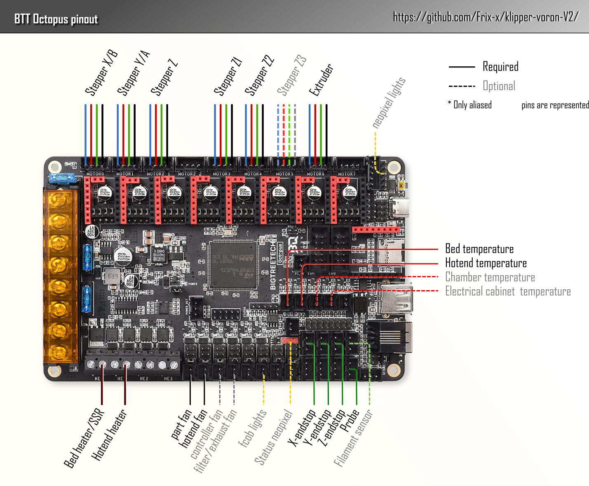

# Board_pins

This config uses `[board_pins]` section to simplify hardware configuration. (see Board_pins in [Official Klipper documentation](https://www.klipper3d.org/Config_Reference.html#board_pins)).

You **should** have a board_pins section for each MCU.
Once the board_pins section is properly configured, 
`aliases` take place in the hardware sections to make them more readable.

> **NOTA** : `[board_pins]` can not contain pin modifiers (`!`,`^`, `~`). In multiple MCU configuration, `aliases` have to be prefixed aliases with mcu name in hardware section (see [`Z_stepper`](../config/hardware/base/Z/V2.4_1.8d_base_z.cfg) as example)

## Examples
[/config/mcus](../config/mcus) folder contains examples of configuration files that you can adjust to your need.
   - Octopus

   - dual SKR 1.4

   - Spider V1
   - Spider V2
   - Spider V1 + sht42
   - probably more to come ...

# Aliases in use in this config

## Steppers
- `[XYZ1-3E]_STEP` : driver Step pins
- `[XYZ1-3E]_DIR` : driver Dir pins
- `[XYZ1-3E]_ENABLE` : driver Enable pins
- `[XYZ1-3E]_TMCUART` : driver UART pins

## Endstops / Probe
- `[XYZ]_STOP` : endstops
- `PROBE_INPUT`

## Heaters    
- `E_HEATER` : hotend heater cartridge
- `BED_HEATER`

## Temperature sensors
- `E_TEMPERATURE` : Hotend temperature sensor
- `BED_TEMPERATURE` 
- `CHAMBER_TEMPERATURE` 
- `ELECTRICAL_CABINET_TEMPERATURE`

## Fans
- `E_FAN` : Hotend fan
- `PART_FAN`
- `FILTER_FAN`
- `CONTROLLER_FAN`

## Lights
- `LIGHT_OUTPUT` : Chamber lights (24v leds)
- `LIGHT_NEOPIXEL` : Neopixel chamber lights
- `STATUS_NEOPIXEL` : Toolhead Neopixel lights

## Other inputs/outputs
- `RUNOUT_SENSOR` : filament motion sensor
- `SERVO_PIN` : for servo driven mecanical probe (as V0 mod)

# External references :
See manufacturers website or github for more information on board pinout.

Here comes some useful links.
- [BTT SKR 1.4](https://github.com/bigtreetech/BIGTREETECH-SKR-V1.3/tree/master/BTT%20SKR%20V1.4)
- [BTT Octopus](https://github.com/bigtreetech/BIGTREETECH-OCTOPUS-V1.0)
- [BTT Manta 8P](https://github.com/bigtreetech/Manta-M8P)
- [Fystec Spiders](https://github.com/FYSETC/FYSETC-SPIDER)
- [Fly SHT](https://mellow.klipper.cn/#/board/fly_sht36_42/)
- [BTT EBB](https://github.com/bigtreetech/EBB)
