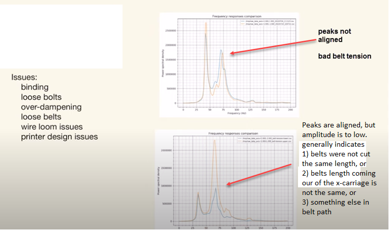
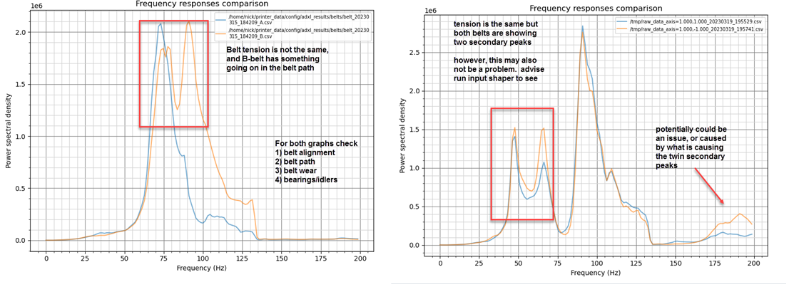

# Belt Shaper 

## Reading the graphs
On these graphs, you want both curves to look similar and overlap to form a single curve. Try to make them fit as closely as possible. It's acceptable to have "noise" around the main peak, but it should be present on both curves with a comparable amplitude. Keep in mind that when you tighten a belt, its main peak should move diagonally toward the upper right corner, changing significantly in amplitude and slightly in frequency. Additionally, the magnitude order of the main peaks should typically range from ~100k to ~1M on most machines.

The resonant frequency/amplitude of the curves depends primarily on three parameters (and the actual tension):

    the mass of the toolhead, which is identical for both belts and has no effect here
    the belt "elasticity", which changes over time as the belt wears. Ensure that you use the same belt brand and type for both A and B belts and that they were installed at the same time
    the belt path length, which is why they must have the exact same number of teeth so that one belt path is not longer than the other when tightened at the same tension

If these three parameters are met, there is no way that the curves could be different or you can be sure that there is an underlying problem in at least one of the belt paths. Also, if the belt graphs have low amplitude curves (no distinct peaks) and a lot of noise, you will probably also have poor input shaper graphs. So before you continue, ensure that you have good belt graphs or fix your belt paths. Start by checking the belt tension, bearings, gantry screws, alignment of the belts on the idlers, and so on.

## Belt Shaper Graphs Examples

The purpose of these examples are to present different belt shaper graphs with some suggestions on how to go about diagnosing and fixing the issue. These graphs were taken from:

3D Printers & a whiteboard, https://www.youtube.com/watch?v=M-yc_XM8sP4; and 

Frix-x, https://github.com/Frix-x/klippain;

with annotations and analysis provided by Frix-x and Reth.

### Note
Interpretation of input shaper graphs may not be straight forward and it is possible to have multiple issues happening at the same time. tighter belt tension is not always the answer. Tightening belts to much can lead to new, and not better, print artifacts

| Comment/Analysis | Belt graphs examples 1 | Belt graphs examples 2 |   Annotated Graphs |
| --- | --- | --- | --- |
| **Both of these two graphs are considered good**. As you can see, the main peak doesn't have to be perfect if you can get both curves to overlap. It is prefered that both graphs overlap in both amplitude and frequency |  |  ||
| **Non-aligned Peaks**. These graphs show where the peaks are not aligned in amplitude and not aligned in frequency. This generally indicates 1) Belts were not cut the same length, 2) belts are not the same length coming out of the carriage, or 3) some other motion system issue. |  | |
| **These two graphs indicate a belt path problem**: the belt tension could be adequate, but something else is happening in the belt paths. Start by checking the bearings and belt wear, or belt alignment |  |  |  |
| **These two graphs show incorrect belt tension**: in each case, one of the belts has insufficient tension (first is B belt, second is A belt). Begin by tightening it half a turn and measuring again |  |  |
