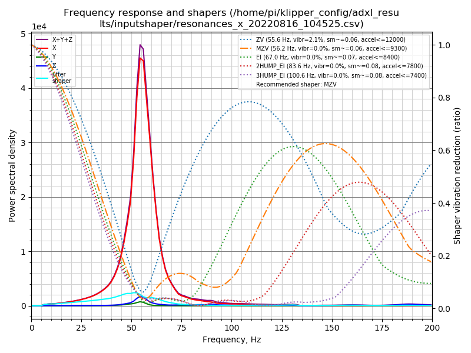

# Input Shaper workflow

## Description

This set of two macros (and associated bash script) is here to help you configure the input shaper algorithms of Klipper. It's a fully automated workflow that:
  1. Run the tests either for the two axis or the two belts to measure the machine behavior using the ADXL345. This is under the hood a scripted call to the Klipper `TEST_RESONANCES` command with the different parameters needed for each axis.
  2. Then, it call an automatic bash script that automate a few things:
     1. it generate the graphs.
     2. it then move the graphs and associated csv to the [ADXL results folder](./../../adxl_results/).
     3. it manage the folder to delete the older files and keep only a set (default is three) of the most recent results.

Results can be found in the [ADXL results folder](./../../adxl_results/) that is placed directly at the root of the config folder to allow the access directly from your browser using the FLuidd/Maisail file manager. No more SSH is needed to calibrate your input shaper!

| Belts resonances example | X resonances example | Y resonances example |
|:----------------------:|:----------------------:|:---------------------:|
|  |  |  |


## Installation

  1. Copy the [IS_shaper_calibrate.cfg](./../../macros/calibration/IS_shaper_calibrate.cfg) macro file directly into your own config.
  2. Be sure to have the `gcode_shell_command.py` Klipper extension installed. Easiest way to install it is to use the advanced section of KIAUH.
  3. Add my [scripts](./../../scripts/) folder at the root of your own config (ie. in your `~/printer_data/config/` directory).
     
     Note: if using Windows to do the copy/paste of the files, be careful with the line endings for the `plot_graphs.sh` file and the `graph_vibrations.py` file: **Linux line endings (LF or \n) are mandatory!** If the file are using Windows line endings, you will get errors like `\r : unknown command` when running the script. If you're not confident regarding your text editor behavior, the best way is to directly download the files on the pi by using for example wget over SSH:
     
     ```
     wget -P ~/printer_data/config/scripts https://raw.githubusercontent.com/Frix-x/klippain/main/scripts/plot_graphs.sh
     wget -P ~/printer_data/config/scripts https://raw.githubusercontent.com/Frix-x/klippain/main/scripts/graph_vibrations.py
     ```

  4. Make the scripts executable using SSH. When in the folder, use:
     
     ```
     chmod +x ./plot_graphs.sh
     chmod +x ./graph_vibrations.py
     ```

  5. Include the `shell_commands.cfg` to your config to be able to call the plot_graphs script. You can either copy/paste its content to your own `printer.cfg` file or just include it using `[include path/to/shell_commands.cfg]`.

     Note: if your user is not `pi`, please correct it in the `[gcode_shell_command plot_graph]` command accordingly.

  6. (Optional) You can modify the first lines of the `plot_graphs.sh` script to configure where you want to store the results. Default: `~/printer_data/config/adxl_results`


## Usage

Be sure your machine is homed and then call one of the following macros:
  - `BELTS_SHAPER_CALIBRATION` to get the belt resonnance graphs. This is usefull to verify the belts tension, but also to check if the belt paths are OK.
  - `AXES_SHAPER_CALIBRATION` to get the standard input shaper graphs and suppress the ringing/ghosting artefacts in your prints.

Then, look for the results in the results folder. You can find them directly in your config folder by using the WebUI of Mainsail/Fluidd.
