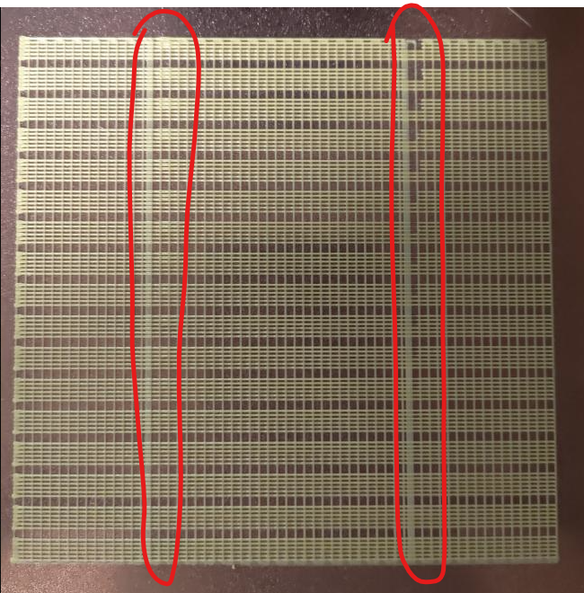

# Pressure advance calibration

The standard way of calibrating the PA is quite ambigous, open to interpretation with a broad margin for error, and use each time a good amount of filament. This macro provide a quick and easy way to calibrate the pressure advance where differences are easier to notice at a glance.


## Description

This macro print a series of ¨bands¨, each containing 6 lines, with the first 3 lines printed slowly and used as baseline/control and the other 3 with variable speeds in the following sequence: 25% of the line at low speed, then 50% at high speed, and the last 25% at low speed again. Then, the pressure advance value is being increased for every band.



The printed model can then be inspected by looking at the top and bottom lines in each band: pressure advance artefacts can be seen where the print speeds change on every line. You just need to find the highest band from the bottom, where the lines at its top still look similar to the lines at its bottom, with no visible extrusion width irregularities or pressure advance artifacts.


## Installation

If you installed and use the full config folder of this github repository, this is already enabled by default and should work out of the box.

If you want to install it to your own custom config, here is the way to go:
  1. Copy the [calibrate_pa.cfg](./../../macros/calibration/calibrate_pa.cfg) macro file directly into your own config.
  2. Be sure to uncomment (if not already the case), the two lines related to pressure advance under the `[extruder]` section of your config. Using 0.040 is a safe default value for direct drive extruders but it doesn't matter that much as it will be changed later and we just want to activate it:
    
     ```
     pressure_advance: 0.040
     pressure_advance_smooth_time: 0.040
     ```

## Usage

First, make sure your axis are homed, your bed mesh is loaded (if you are using one), both the hotend and the bed are at the temperature required for your filament and the machine is ready to print something. Don't forget to do the QGL, Z-tilt, set your Z offset correctly, ... Basically you can call your `PRINT_START` manually or replicate all the required steps.

Then, start the print by calling the macro in the klipper console (using Mainsail/Fluidd/Octoprint). For example, here is what I'm using on my Voron machines using direct drive extruders:

```
PRESSURE_ADVANCE_CALIBRATION START=0.02 INCREMENT=0.0025 RAFT=1 OUTER_SPEED=20 INNER_SPEED=200 PURGE_MM=4 LINES_PER_BAND=2
```

Regarding the parameters availables when calling the `PRESSURE_ADVANCE_CALIBRATION` macro, please see this table:

| parameters | default value | description |
|-----------:|---------------|-------------|
|DO_RAFT|1|print a "base" to support the test grid (better bed adhesion and easier to remove at the end)|
|START|0.02|PA value to start with|
|INCREMENT|0.005|PA value to increment for each subsequent band|
|EXTRUSION_MULTIPLIER|1.25 if raft enabled, 1.5 if disabled|extrusion multiplier to apply to printing lines in the band|
|PRINT_SIZE|120|maximum width/height, in mm, that the test can make use of. The model will be printed in the middle of the bed|
|BANDS_LIMIT|999|optionally the number of bands can be limited this way. Otherwise as many bands that fit in the given SIZE will be printed|
|LINES_PER_BAND|6|number of lines per band. Half of these will be control, another half the test lines|
|LINE_SPACING|0.4|spacing between individual lines in a band|
|PURGE_MM|8|mm of filament pushed to initiate pressure before starting the print (can be 0 to disable)|
|RAFT_SPEED|80|feedrate (in mm/s) for printing the raft|
|CONTROL_SPEED|30|feedrate (in mm/s) for printing the "control" lines in a band|
|OUTER_SPEED|40|feedrate (in mm/s) for printing the outer part of the "test" lines in a band|
|INNER_SPEED|80|feedrate (in mm/s) for printing the inner part of the "test" lines in a band|
|TRAVEL_SPEED|200|feedrate (in mm/s) for fast travel moves|
|RETRACT_LENGTH|0.6|retraction length in mm (use your own retraction value for the filament)|

Then, count the number of bands from the bottom of the print until the control lines look similar to the test lines. You should look in the red area, where the speed change during the print: check to find the band where there is no bulge or no gap like in the following image:


Then use the following formula to get the new PA value to use:

```
NEW_PA = START + (INCREMENT * band_number)

# So if using my example macro call from above:
NEW_PA = 0.020 + (0.0025 * band_number)
```


## Partnerships

I've got some youtube coverage on that topic:
  - From CrydTeam in german: [Klipper Kalibrierungstool](https://www.youtube.com/watch?v=wlEl437ix8o&t=795s)
