# Tuning Klipper's Input Shaper system

As more and more people use my macros, questions about interpreting the resonnance testing results arise. This document aims to provide some guidance on how to interpret them. Keep in mind that there is no universal method: different people may interpret the results differently or could have other opinions. It's important to experiment and find what works best for your own 3D printer.


## Understanding ringing
When a 3D printer moves, the motors apply some force to move the toolhead along a precise path. This force is transmitted from the motor shaft to the toolhead through the entire printer motion system. When the toolhead reaches a sharp corner and needs to change direction, its inertia makes it want to continue the movement in a straight line. The motors force the toolhead to turn, but the belts act like springs, allowing the toolhead to oscillate in the perpendicular direction. These oscillations produce visible artifacts on the printed parts, known as ringing or ghosting.

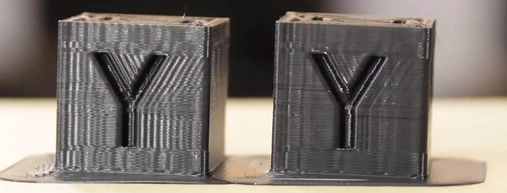


## Reading the graphs

When tuning Input Shaper, keep the following in mind:
  1. **Focus on the shape of the graphs, not the exact numbers**. There could be differences between ADXL boards or even printers, so there is no specific "target" value. This means that you shouldn't expect to get the same graphs between different printers, even if they are similar in term of brand, parts, size and assembly.
  1. Small differences between consecutive test runs are normal, as ADXL quality and sensitivity is quite variable between boards.
  1. Perform the tests when the machine is heat-soaked and close to printing conditions, as belt tension can change with temperature.
  1. Avoid running the toolhead fans during the tests, as they introduce unnecessary noise to the graphs, making them harder to interpret. This means that even if you should heatsoak the printer, you should also refrain from activating the hotend heater during the test, as it will also trigger the hotend fan. However, as a bad fan can introduce some vibrations, feel free to use the test to diagnose an unbalanced fan as seen in the [Examples of Input Shaper graphs](#examples-of-input-shaper-graphs) section.
  1. Ensure the accuracy of your ADXL measurements by running a `MEASURE_AXES_NOISE` test and checking that the result is below 100 for all axes. If it's not, check your ADXL and wiring before continuing.
  1. The graphs can only show symptoms of possible problems and in different ways. Those symptoms can sometimes suggest causes, but they rarely pinpoint issues.
  1. Remember why you're running these tests (clean prints) and don't become too obsessive over perfect graphs. 

  > **Note**
  >
  > Click on the section names below to expand them

<details>
<summary>1. Belt graphs</summary><br />

**Before starting, ensure that the belts are properly tensioned**. For example, you can follow the [Voron belt tensioning documentation](https://docs.vorondesign.com/tuning/secondary_printer_tuning.html#belt-tension). This is crucial!

Next, generate the belt graphs using the `BELTS_SHAPER_CALIBRATION` macro. Refer to the [IS workflow documentation](./features/is_workflow.md) for more information.

#### Read the graphs

On these graphs, you want both curves to look similar and overlap to form a single curve. Try to make them fit as closely as possible. It's acceptable to have "noise" around the main peak, but it should be present on both curves with a comparable amplitude. Keep in mind that when you tighten a belt, its main peak should move diagonally toward the upper right corner, changing significantly in amplitude and slightly in frequency. Additionally, the magnitude order of the main peaks *should typically* range from ~100k to ~1M on most machines.

The resonant frequency/amplitude of the curves depends primarily on three parameters (and the actual tension):
  - the *mass of the toolhead*, which is identical for both belts and has no effect here
  - the *belt "elasticity"*, which changes over time as the belt wears. Ensure that you use the **same belt brand and type** for both A and B belts and that they were **installed at the same time**
  - the *belt path length*, which is why they must have the **exact same number of teeth** so that one belt path is not longer than the other when tightened at the same tension

**If these three parameters are met, there is no way that the curves could be different** or you can be sure that there is an underlying problem in at least one of the belt paths. Also, if the belt graphs have low amplitude curves (no distinct peaks) and a lot of noise, you will probably also have poor input shaper graphs. So before you continue, ensure that you have good belt graphs or fix your belt paths. Start by checking the belt tension, bearings, gantry screws, alignment of the belts on the idlers, and so on.

#### Examples of belt graphs

| Comment | Belt graphs examples 1 | Belt graphs examples 2 |
| --- | --- | --- |
| **Both of these two graphs are considered good**. As you can see, the main peak doesn't have to be perfect if you can get both curves to overlap |  |  |
| **These two graphs show incorrect belt tension**: in each case, one of the belts has insufficient tension (first is B belt, second is A belt). Begin by tightening it half a turn and measuring again | 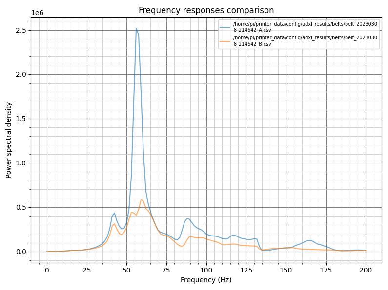 | 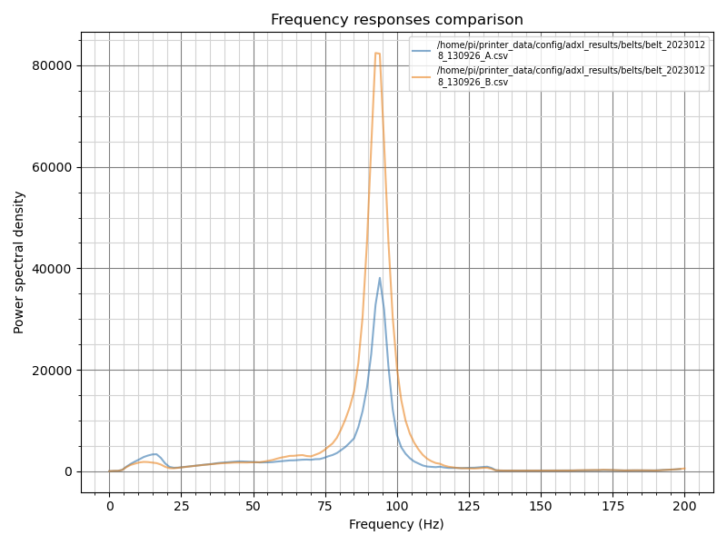 |
| **These two graphs indicate a belt path problem**: the belt tension could be adequate, but something else is happening in the belt paths. Start by checking the bearings and belt wear, or belt alignment | 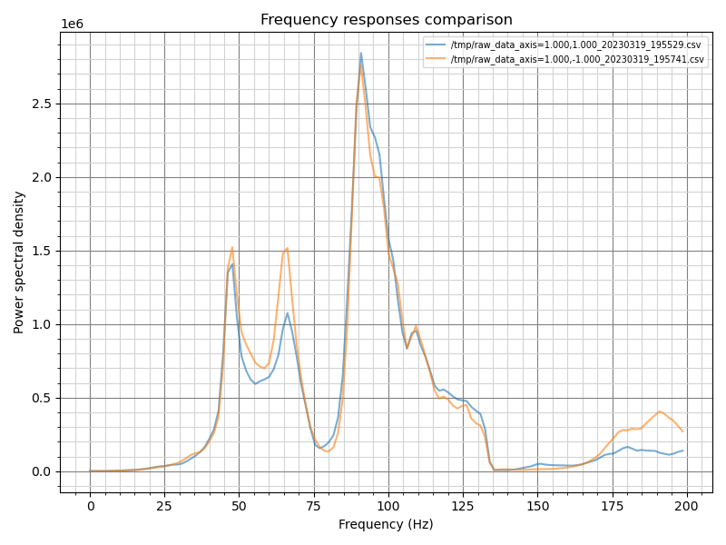 | 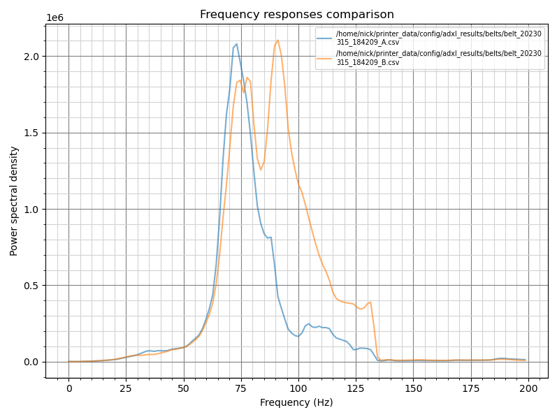 |

</details>


<details>
<summary>2. Input Shaper graphs</summary><br />

**Before starting, ensure that the belts are properly tensioned** and that you already have good and clear belt graphs (see the previous section).

Next, generate the Input Shaper graphs using the `AXES_SHAPER_CALIBRATION` macro. Refer to the [IS workflow documentation](./features/is_workflow.md) for more information.

#### Read the graphs

To effectively analyze input shaper graphs, there is no one-size-fits-all approach due to the variety of factors that can impact the 3D printer's performance or input shaper measurements. However, here are some hints on reading the graphs:
  - A graph with a **single and thin peak** well detached from the background noise is ideal, as it can be easily filtered by input shaping. But depending on the machine and its mechanical configuration, it's not always possible to obtain this shape. The key to getting better graphs is a clean mechanical assembly with a special focus on the rigidity and stiffness of everything, from the table through the frame of the printer to the toolhead.
  - As for the belt graphs, **focus on the shape of the graphs, not the exact frequency and energy value**. Indeed, the energy value doesn't provide much useful information. Use it only to compare two of your own graphs and to measure the impact of your mechanical changes between two consecutive tests, but never use it to compare against graphs from other people or other machines.

When you are satisfied with your graphs, you will need to use the auto-computed values at the top to set the Input Shaping filters in your Klipper configuration.

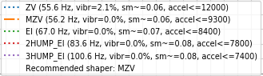

Here is some info to help you understand them:
  - These data are automatically computed by a specific Klipper algorithm. This algorithm works pretty well if the graphs are clean enough. But **if your graphs are junk, it can't do magic and will give you pretty bad recommendations**: they will do nothing or even make the ringing worse, so do not use the values and fix your printer first!
  - The recommended acceleration values (`accel<=...`) are not meant to be read alone. You need to also look at the `vibr` and `sm` values. They will give you the percentage of remaining vibrations and the smoothing after Input Shaping, if you use the recommended acceleration.
  - Nothing will prevent you from using higher acceleration values; they are not a limit. However, if you do so, expect more vibrations and smoothing. Also, Input Shaping may find its limits and not be able to suppress all the ringing on your parts.
  - The remaining vibrations `vibr` value is highly linked to ringing. So try to choose a filter with a very low value or even 0% if possible.
  - High acceleration values are not useful at all if there is still a high level of remaining vibrations. You should address any mechanical issues before continuing.
  - Each line represents the name of a different filtering algorithm. Each of them has its pros and cons:
    * `ZV` is a pretty light filter and usually has some remaining vibrations. My recommendation would be to use it only if you want to do speed benchies and get the highest acceleration values while maintaining a low amount of smoothing on your parts. If you have "perfect" graphs and do not care that much about some remaining ringing, you can try it. 
    * `MZV` is most of the time the best filter on a well-tuned machine. It's a good compromise for low remaining vibrations while still allowing pretty good acceleration values. Keep in mind, `MZV` is only recommended by the algorithm on good graphs.
    * `EI` works "ok" if you are not able to get better graphs. But first, try to fix your mechanical issues as best as you can before using it: almost every printer should be able to run `MZV` instead.
    * `2HUMP_EI` and `3HUMP_EI` are not recommended and should be used only as a last resort. Usually, they lead to a high level of smoothing in order to suppress the ringing while also using relatively low acceleration values. If you get these algorithms recommended, you can almost be sure that you have mechanical problems under the hood (that lead to pretty bad or "wide" graphs).

Then, just add to your configuration:
```
[input_shaper]
shaper_freq_x: ... # center frequency for the X axis filter
shaper_type_x: ... # filter type for the X axis
shaper_freq_y: ... # center frequency for the Y axis filter
shaper_type_y: ... # filter type for the Y axis
```

#### Useful facts and myths debunking

Sometimes people advise limiting the data to 100 Hz by manually editing the resulting .csv file because excitation does not go that high and these values should be ignored and considered wrong. This is a misconception and a bad idea because the excitation frequency is very different from the response frequency of the system, and they are not correlated at all. Indeed, it's plausible to get higher vibration frequencies, and editing the file manually will just "ignore" them and make them invisible even if they are still there on your printer. While higher frequency vibrations may not have a substantial effect on print quality, they can still indicate other issues within the system, likely noise and wear to the mechanical parts. Instead, focus on addressing the mechanical issues causing these problems.

Another point is that I do not recommend using an extra-light X-beam (aluminum or carbon) on your machine, as it can negatively impact the printer's performance and Input Shaping results. Indeed, there is more than just mass at play (see the [theory behind it](#theory-behind-it)): lower mass also means more flexibility and more prone to wobble under high accelerations. This will impact negatively the Y axis graphs as the X-beam will flex under high accelerations.

Finally, keep in mind that each axis has its own properties, such as mass and geometry, which will lead to different behaviors for each of them and will require different filters. Using the same input shaping settings for both axes is only valid if both axes are similar mechanically: this may be true for some machines, mainly Cross gantry configurations such as [CroXY](https://github.com/CroXY3D/CroXY) or [Annex-Engineering](https://github.com/Annex-Engineering) printers, but not for others.

#### Examples of Input Shaper graphs

In the following examples, the graphs are random graphs found online or sent to me for analysis. They are not necessarily to be read in pairs: the two graph columns are here to illustrate the comment with more than one example.

| Comment | Example 1 | Example 2 |
| --- | --- | --- |
| **These two graphs are considered good**. As you can see, there is only one thin peak, well separated from the background noise | 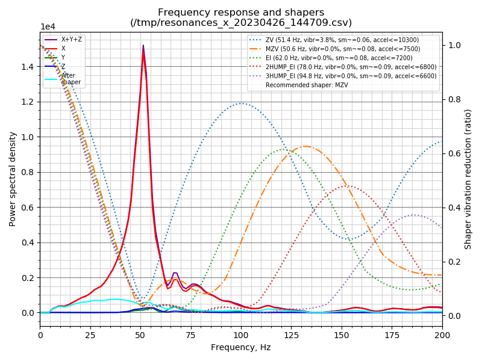 | 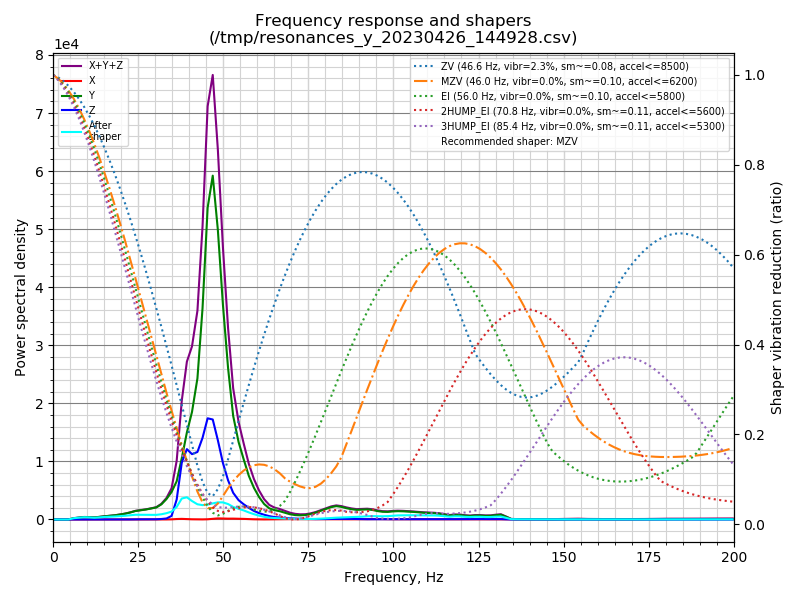 |
| **These two graphs are really bad**: there is a lot of noise all over the spectrum. Something is really wrong and you should check all moving parts and screws. You should also check the belt tension and proper geometry of the gantry (racking) | 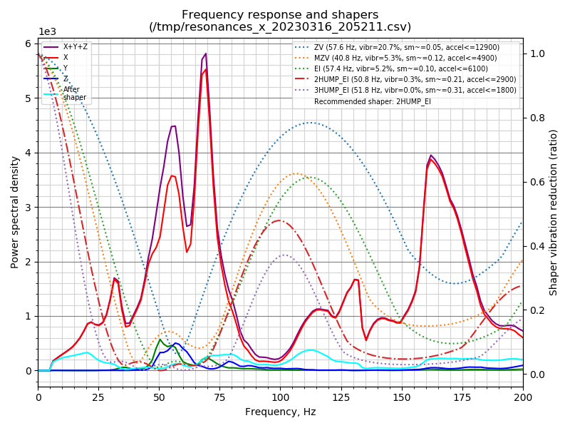 | 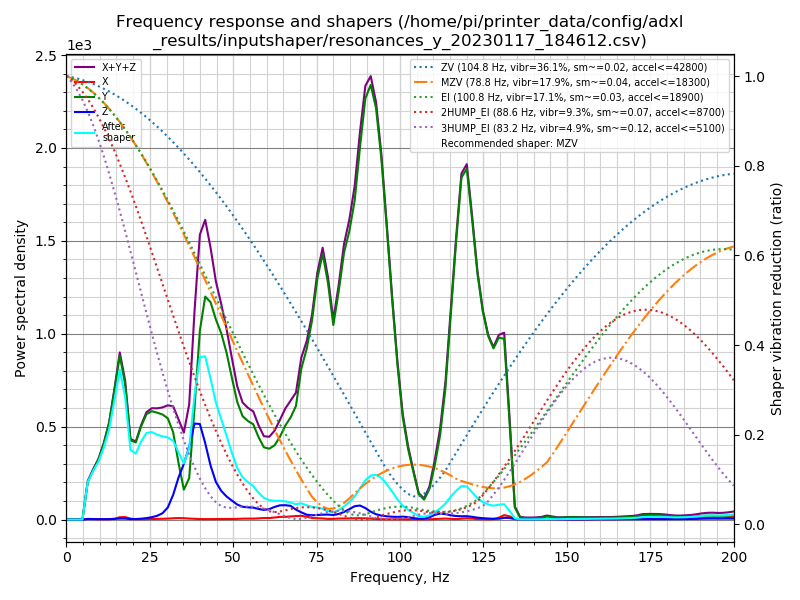 |
| These two graphs have some **low frequency energy**. This usually means that there is some binding or grinding in the kinematics: something isn't moving freely. Check the belt alignment on the idlers, bearings, etc... | 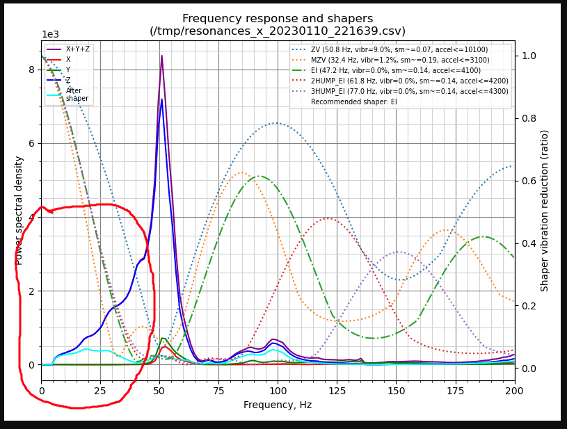 | 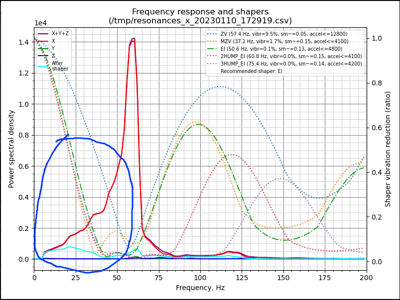 |
| These two graphs show **the TAP wobble problem**: check that the TAP MGN rail has the correct preload for stiffness and that the magnets are correct N52. Also pay attention to the assembly to make sure that everything is properly tightened | 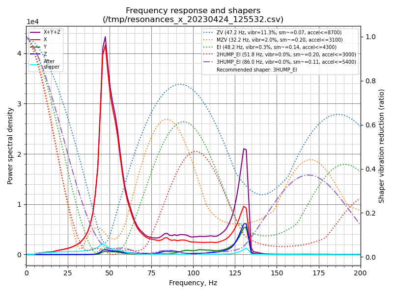 | 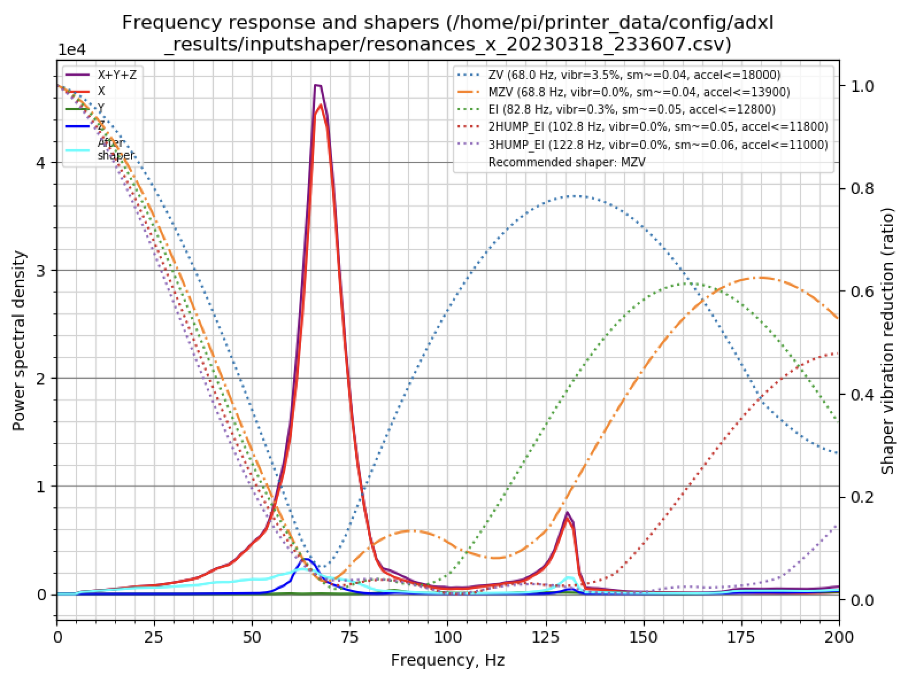 |
| Here you can see **the effect of an unbalanced fan**: even if you should let the fan off during the final IS tuning, you can use this test to validate their correct behavior: an unbalanced fan usually add some very thin peak around 100-150Hz that disapear when the fan is off during the measurement | 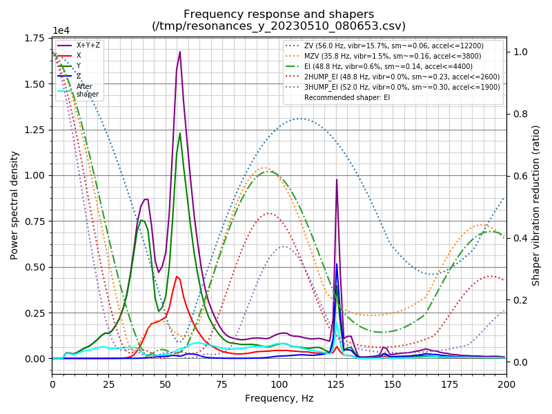 |  |
| The graph on the left shows **a CANbus problem** (problem solved on the right): although the general shape looks good, the graph is not smooth but spiky. There is also usually some low frequency energy. This happens when the bus speed is too low: set it to 1M to solve the problem | 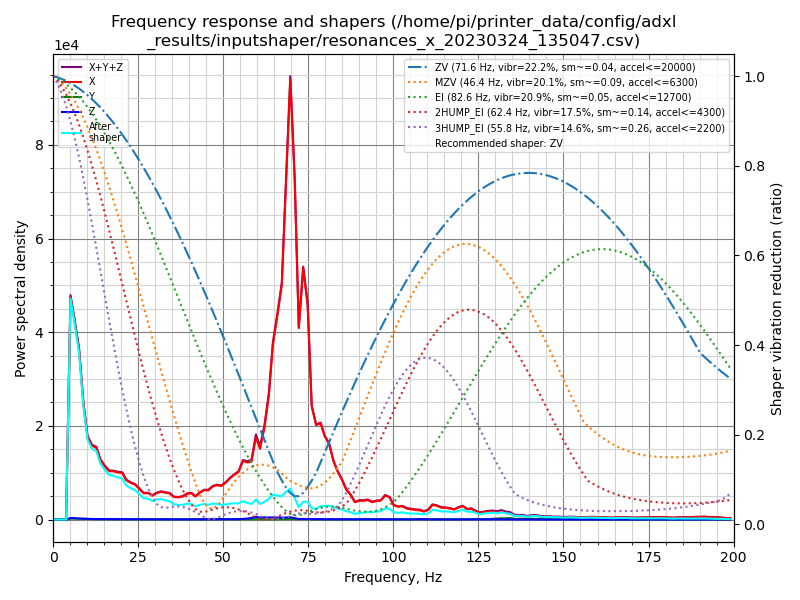 | 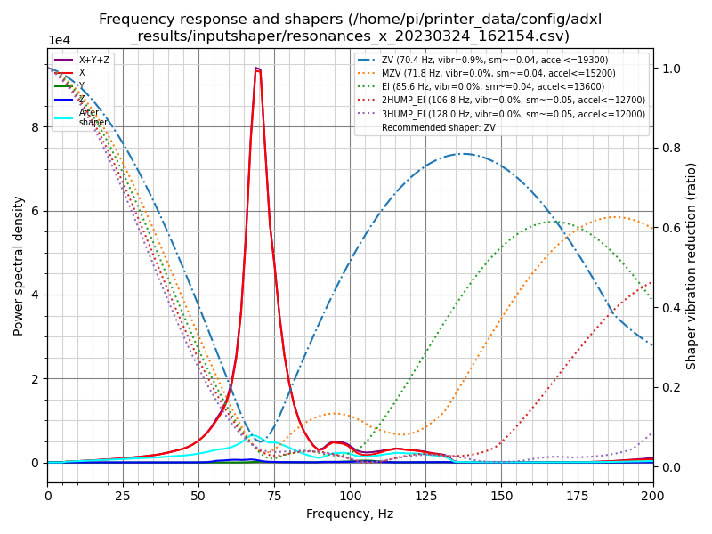 |

</details>


<details>
<summary>3. Klippain vibrations graphs</summary><br />

More details to be added later in this section...

</details>


<details>
<summary>Special note on accelerometer (ADXL) mounting point</summary><br />

Input Shaping algorithms work by suppressing a single resonant frequency (or a range around a single resonant frequency). When setting the filter, **the primary goal is to target the resonant frequency of the toolhead and belts system** (see the [theory behind it](#theory-behind-it)), as this system has the most significant impact on print quality and is the root cause of ringing.

When setting up Input Shaper, it is important to consider the accelerometer mounting point. There are mainly two possibilities, each with its pros and cons:
  1. **Directly at the nozzle tip**: This method provides a more accurate and comprehensive measurement of everything in your machine. It captures the main resonant frequency along with other vibrations and movements, such as toolhead wobbling and printer frame movements. This approach is excellent for diagnosing your machine's kinematics and troubleshooting problems. However, it also leads to noisier graphs, making it harder for the algorithm to select the correct filter for input shaping. Graphs may appear worse, but this is due to the different "point of view" of the printer's behavior.
  1. **At the toolhead's center of gravity**: I personally recommend mounting the accelerometer in this way, as it provides a clear view of the main resonant frequency you want to target, allowing for accurate input shaper filter settings. This approach results in cleaner graphs with less visible noise from other subsystem vibrations, making interpretation easier for both automatic algorithms and users. However, this method provides less detail in the graphs and may be slightly less effective for troubleshooting printer problems.

A suggested workflow is to first use the nozzle mount to diagnose mechanical issues, such as loose screws or a bad X carriage. Once the mechanics are in good condition, switch to a mounting point closer to the toolhead's center of gravity for setting the input shaper filter settings by using cleaner graphs that highlights the most impactful frequency.

</details>


## Theory behind it

### Modeling the motion system
The motion system of a 3D printer can be described as a spring and mass system, best modeled as a [harmonic oscillator](https://en.wikipedia.org/wiki/Harmonic_oscillator). This type of system has two key parameters:

| Schematics | Undamped resonnant frequency<br />(natural frequency) | Damping ratio ζ |
| --- | --- | --- |
| 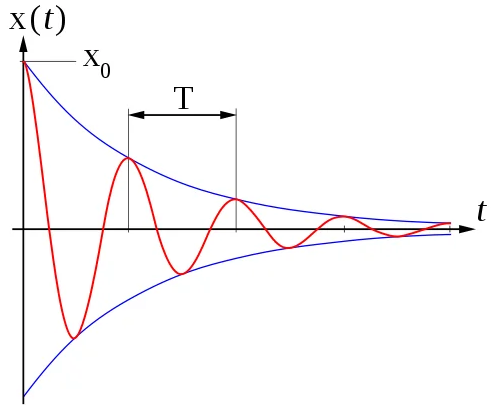 | $$\frac{1}{2\pi}\sqrt{\frac{k}{m}}$$ | $$\frac{c}{2}\sqrt{\frac{1}{km}}$$ |
| See [here for examples](https://beltoforion.de/en/harmonic_oscillator/) | `k` [N/m]: spring constant<br />`m` [g]: moving mass | `c` [N·s/m]: viscous damping coefficient<br />`k` [N/m]: spring constant<br />`m` [g]: moving mass |

When an oscillating input force is applied at a resonant frequency (or a Fourier component of it) on a dynamic system, the system will oscillate at a higher amplitude than when the same force is applied at other, non-resonant frequencies. This is called a resonance and can be dangerous for some systems but on our printers this will mainly lead to vibrations and oscillations of the toolhead.

On the other hand, the damping ratio (ζ) is a dimensionless measure describing how oscillations in a system decay after a perturbation. It can vary from underdamped (ζ < 1), through critically damped (ζ = 1) to overdamped (ζ > 1).

In 3D printers, it's quite challenging to measure the spring constant `k` and even more challenging to measure the viscous damping coefficient `c`, as they are affected by various factors such as belts, plastic parts, frame rigidity, rails, friction, grease, and motor control. Furthermore, a 3D printer is made up of many subsystems, each with its own behavior. Some subsystems, such as the toolhead/belts system, have a bigger impact on ringing than others, such as the motor shaft resonance for example.

### How Input Shaping helps
The rapid movement of machines is a challenging control problem because it often results in high levels of vibration. As a result, machines are typically moved relatively slowly. Input shaping is an open-loop control method that allows for higher speeds of motion by limiting vibration induced by the reference command. It can also improve the reliability of the stealthChop mode of Trinamic stepper drivers.

It works by creating a command signal that cancels its own vibration, achieved by [convoluting](https://en.wikipedia.org/wiki/Convolution) specifically crafted impulse signals (A2) with the original system control signal (A1). The resulting shaped signal is then used to drive the system (Total Response). To craft these impulses, the system's undamped resonant frequency and damping ratio are used.

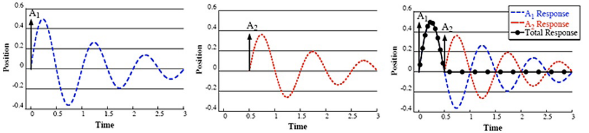

Klipper measures these parameters by exciting the printer with a series of input commands and recording the response behavior using an accelerometer. Resonances can be identified on the resulting graphs by large spikes indicating their frequency and energy. Additionnaly, the damping ratio is usually unknown and hard to estimate without a special equipment, so Klipper uses 0.1 value by default, which is a good all-round value that works well for most 3D printers.
