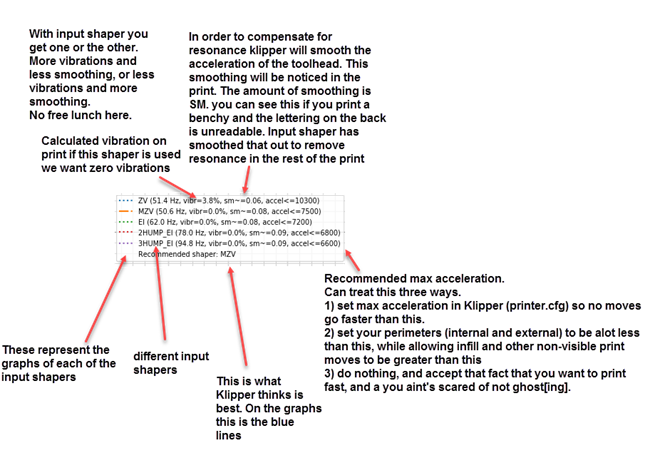
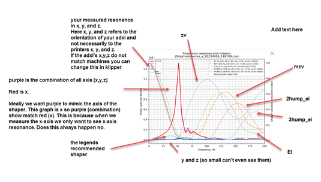
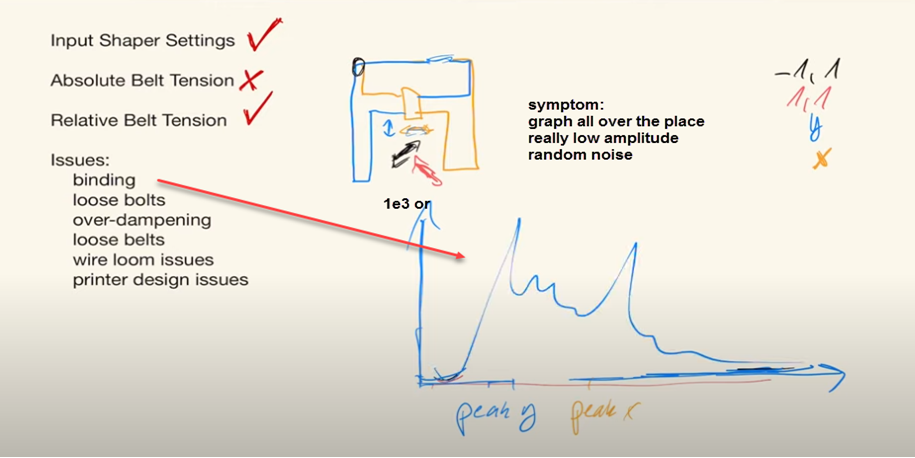
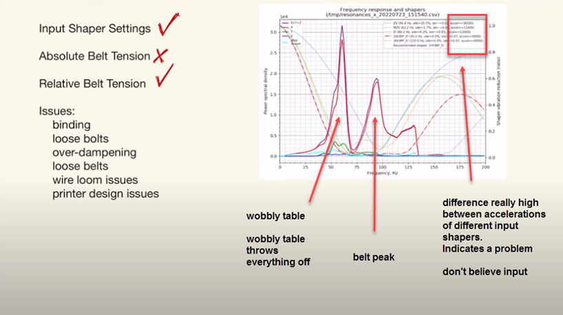
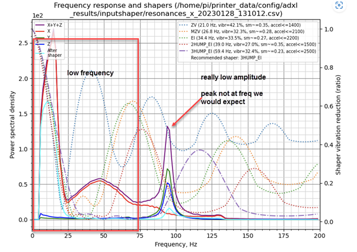
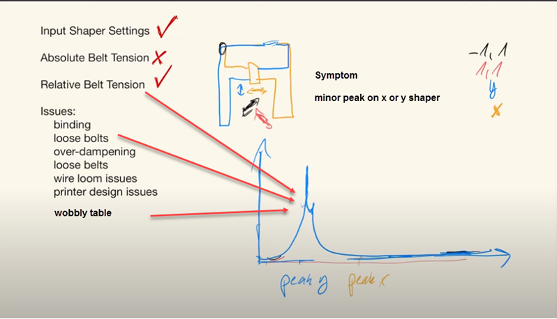
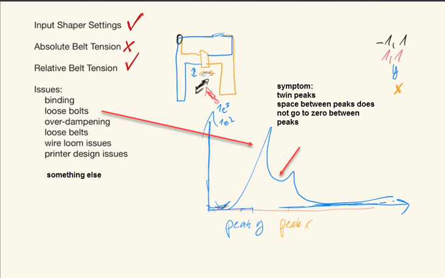
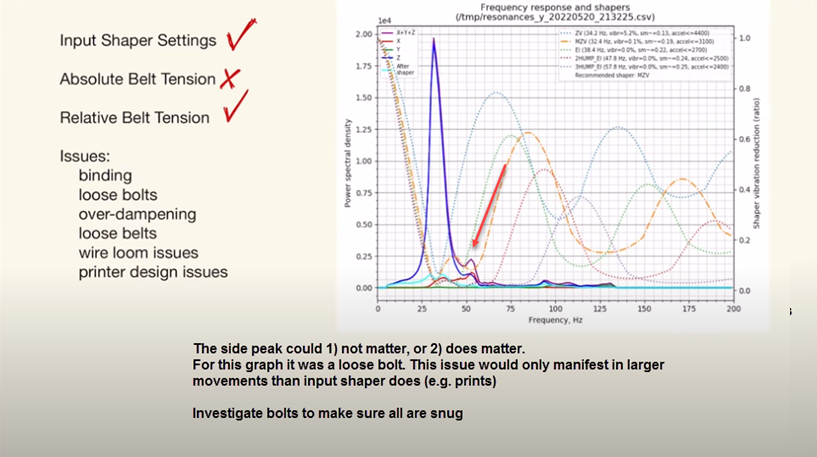

# Input Shaper Graphs 
**Before starting, ensure that the belts are properly tensioned** and that you already have good and clear belt graphs (see the previous section).

Next, generate the Input Shaper graphs using the `AXES_SHAPER_CALIBRATION` macro. Refer to the [IS workflow documentation](./features/is_workflow.md) for more information.

### Reading the graphs

To effectively analyze input shaper graphs, there is no one-size-fits-all approach due to the variety of factors that can impact the 3D printer's performance or input shaper measurements. However, here are some hints on reading the graphs:
  - A graph with a **single and thin peak** well detached from the background noise is ideal, as it can be easily filtered by input shaping. But depending on the machine and its mechanical configuration, it's not always possible to obtain this shape. The key to getting better graphs is a clean mechanical assembly with a special focus on the rigidity and stiffness of everything, from the table through the frame of the printer to the toolhead.
  - As for the belt graphs, **focus on the shape of the graphs, not the exact frequency and energy value**. Indeed, the energy value doesn't provide much useful information. Use it only to compare two of your own graphs and to measure the impact of your mechanical changes between two consecutive tests, but never use it to compare against graphs from other people or other machines.

When you are satisfied with your graphs, you will need to use the auto-computed values at the top to set the Input Shaping filters in your Klipper configuration.


| legend | graph |
| --- | --- |
| |  |

Here is some info to help you understand them:
  - These data are automatically computed by a specific Klipper algorithm. This algorithm works pretty well if the graphs are clean enough. But **if your graphs are junk, it can't do magic and will give you pretty bad recommendations**: they will do 
  nothing or even make the ringing worse, so do not use the values and fix your printer first!
  - The recommended acceleration values (`accel<=...`) are not meant to be read alone. You need to also look at the `vibr` and `sm` values. They will give you the percentage of remaining vibrations and the smoothing after Input Shaping, if you use the recommended acceleration.
  - Nothing will prevent you from using higher acceleration values; they are not a limit. However, if you do so, expect more vibrations and smoothing. Also, Input Shaping may find its limits and not be able to suppress all the ringing on your parts.
  - The remaining vibrations `vibr` value is highly linked to ringing. So try to choose a filter with a very low value or even 0% if possible.
  - High acceleration values are not useful at all if there is still a high level of remaining vibrations. You should address any mechanical issues before continuing.
  - Each line represents the name of a different filtering algorithm. Each of them has its pros and cons:
    * `ZV` is a pretty light filter and usually has some remaining vibrations. My recommendation would be to use it only if you want to do speed benchies and get the highest acceleration values while maintaining a low amount of smoothing on your parts. If you have "perfect" graphs and do not care that much about some remaining ringing, you can try it. 
    * `MZV` is most of the time the best filter on a well-tuned machine. It's a good compromise for low remaining vibrations while still allowing pretty good acceleration values. Keep in mind, `MZV` is only recommended by the algorithm on good graphs.
    * `EI` works "ok" if you are not able to get better graphs. But first, try to fix your mechanical issues as best as you can before using it: almost every printer should be able to run `MZV` instead.
    * `2HUMP_EI` and `3HUMP_EI` are not recommended and should be used only as a last resort. Usually, they lead to a high level of smoothing in order to suppress the ringing while also using relatively low acceleration values. If you get these algorithms recommended, you can almost be sure that you have mechanical problems under the hood (that lead to pretty bad or "wide" graphs).

Then, just add to your configuration:
```
[input_shaper]
shaper_freq_x: ... # center frequency for the X axis filter
shaper_type_x: ... # filter type for the X axis
damping_ratio_x... # Damping Ratio reported in X graph
shaper_freq_y: ... # center frequency for the Y axis filter
shaper_type_y: ... # filter type for the Y axis
damping_ratio_y... # Damping Ratio reported in Y graph
```

### Useful facts and myths debunking

Sometimes people advise limiting the data to 100 Hz by manually editing the resulting .csv file because excitation does not go that high and these values should be ignored and considered wrong. This is a misconception and a bad idea because the excitation frequency is very different from the response frequency of the system, and they are not correlated at all. Indeed, it's plausible to get higher vibration frequencies, and editing the file manually will just "ignore" them and make them invisible even if they are still there on your printer. While higher frequency vibrations may not have a substantial effect on print quality, they can still indicate other issues within the system, likely noise and wear to the mechanical parts. Instead, focus on addressing the mechanical issues causing these problems.

Another point is that I do not recommend using an extra-light X-beam (aluminum or carbon) on your machine, as it can negatively impact the printer's performance and Input Shaping results. Indeed, there is more than just mass at play (see the [theory behind it](#theory-behind-it)): lower mass also means more flexibility and more prone to wobble under high accelerations. This will impact negatively the Y axis graphs as the X-beam will flex under high accelerations.

Finally, keep in mind that each axis has its own properties, such as mass and geometry, which will lead to different behaviors for each of them and will require different filters. Using the same input shaping settings for both axes is only valid if both axes are similar mechanically: this may be true for some machines, mainly Cross gantry configurations such as [CroXY](https://github.com/CroXY3D/CroXY) or [Annex-Engineering](https://github.com/Annex-Engineering) printers, but not for others.

### Special note on accelerometer (ADXL) mounting point

Input Shaping algorithms work by suppressing a single resonant frequency (or a range around a single resonant frequency). When setting the filter, **the primary goal is to target the resonant frequency of the toolhead and belts system** (see the [theory behind it](#theory-behind-it)), as this system has the most significant impact on print quality and is the root cause of ringing.

When setting up Input Shaper, it is important to consider the accelerometer mounting point. There are mainly two possibilities, each with its pros and cons:
  1. **Directly at the nozzle tip**: This method provides a more accurate and comprehensive measurement of everything in your machine. It captures the main resonant frequency along with other vibrations and movements, such as toolhead wobbling and printer frame movements. This approach is excellent for diagnosing your machine's kinematics and troubleshooting problems. However, it also leads to noisier graphs, making it harder for the algorithm to select the correct filter for input shaping. Graphs may appear worse, but this is due to the different "point of view" of the printer's behavior.
  1. **At the toolhead's center of gravity**: I personally recommend mounting the accelerometer in this way, as it provides a clear view of the main resonant frequency you want to target, allowing for accurate input shaper filter settings. This approach results in cleaner graphs with less visible noise from other subsystem vibrations, making interpretation easier for both automatic algorithms and users. However, this method provides less detail in the graphs and may be slightly less effective for troubleshooting printer problems.

A suggested workflow is to first use the nozzle mount to diagnose mechanical issues, such as loose screws or a bad X carriage. Once the mechanics are in good condition, switch to a mounting point closer to the toolhead's center of gravity for setting the input shaper filter settings by using cleaner graphs that highlights the most impactful frequency.

</details>


## Examples of Input Shaper graphs

In the following examples, the graphs are random graphs found online or sent to me for analysis. The graphs are here to illustrate the issue with more than one example.

***Warning***

As of right now Input Shaper is not a science. Yes we can draw some conclusions based upon the graph, but for the most part by looking at the graph one cannot draw definitive explainations for what is causing your imperfect graphs. Further, it is possible that different issues will show up as the same issue on graphs. Therefore, the graph examples below are meant as a guide on some possible causes. There are not meant to be taken as fact. Merely guidepost in your input shaper adventure.

### Good Graphs
**These two graphs are considered good**. As you can see, there is only one thin peak, well separated from the background noise 
| Good Graph  |  | 
| --- | --- |
  |  |


### Crazy graphs - Binding, Relative Belt Tension, Wobbly Table, Canbus
This graph shows a main peak without the amplitude going down to, or approachings zero, before rising again into a secondary peak before finally going down to zero. This could be indicative of a binding of the motion system, relative belt tension being off, or a wobbly table. As will be shown later below this could also be caused by to low a frequency on canbus. 
* Troubleshooting: 
1. start by placing the printer on a stable surface such as the floor. 
1. check belt path. Make sure the belts are in the middle of the bearings and in the middle of the motor idlers. 
1. derack the printer. 
1. re-tension and rerun input shaper
1. if problem persist consider squareness of frame, relubing/replacing linear rails, replacing bearings/idlers


| Crazy Graphs |  |
| --- | --- |
|  |  |
|  | |

| Wobbly Table | |
| --- | --- |
|  | |

As one can see the wobbly table has a similar graph as the Crazy Graphs. This is why the first step in troubleshooting one of these graphs is to put the printer on a solid surface. Hardwood, or tile floor preferred. Carpet is not preferred. To squishy

### Low Frequency - Binding or Grinding
These two graphs have some **low frequency energy**. This usually means that there is some binding or grinding in the kinematics: something isn't moving freely. Check the belt alignment on the idlers, bearings, etc... 
| Low Frequency | Low Frequency |
| --- | --- |
|  |  |
| |  | 

### Potentially Loose Bolt 
This graph shows a main peak without the amplitude going down to, or approachings zero, before rising again into a secondary peak before finally going down to zero. This could be indicative of a binding of the motion system, relative belt tension being off, or a **loose bolt**. As will be shown later below this could also be caused by to low a frequency on canbus. 
| Loose Bolt |  |
| --- | --- |
|  |  |
| Potentially Loose Bolt, or nothing at all | |

|  | |


### Canbus Problems
The first loose bolt picture can also be a canbus problem if canbus is being used. Please focus on the middle spike for canbus problems. See how the middle spike comprises a secondary spike. This could be indicative of canbus. Although the general shape looks good, the graph is not smooth but spiky. There is also usually some low frequency energy. This happens when the bus speed is too low: set it to 1M to solve the problem 
|Canbus problem | Canbus solved |
| --- | --- |
|  |  |


### Tool Head, or Tap
These two graphs show **the TAP wobble problem**: check that the TAP MGN rail has the correct preload for stiffness and that the magnets are correct N52. Also pay attention to the assembly to make sure that everything is properly tightened.

It has been obvserved that, at least for voron printers, 125hz is also assocated with the toolhead in general. Toolhead issues may not be as spiky as the graphs below. The could also produce a more hump version. If you see a 125hz bump, hump, or spike the toolhead needs to be investigated.

**Troubleshooting:**
1. Break down the toolhead down to the belts. You do not need to remove the belts
2. make sure all screws are tight as you rebuilt the toolhead. Make sure TAP magnets are engaged
3. check the extruder. Make sure you do not have loose screw in it.

| Tap Wobble | |
| --- | --- |
|  |  |


### Unbalanced Fan
Here you can see **the effect of an unbalanced fan**: even if you should let the fan off during the final IS tuning, you can use this test to validate their correct behavior: an unbalanced fan usually add some very thin peak around 100-150Hz that disapear when the fan is off during the measurement 

It should be noted that the unbalanced fan will have a greater peak than a loose screw in the toolhead or TAP issues.

It should be further noted that the graph below shows another issue besides unbalanced fan. This other issue could be a wobbly table, a loose screw, or low frequency binding.

| unbalanced fan when on | unbalanced fan when off|
| --- | --- |
|  |  |
