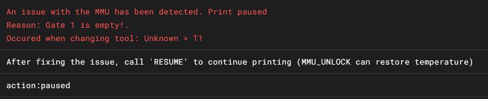

# MMU Configuration in Klippain

Klippain is fully compatible with Multi-Material Units (MMU) and leverages the [HappyHare](https://github.com/moggieuk/Happy-Hare) software backend for an easy and effective use of them.

This documentation outlines the procedures for setting up and operate an MMU within Klippain. It includes instructions on proper usage and troubleshooting common issues.


## Installing HappyHare

  > **Note**:
  >
  > If you were using the previous ERCF-Software-V3, move your old `ercf_***.cfg` files in a safe place for future reference and then uninstall it completely by running `~/ERCF-Software-V3/install.sh -u && rm -rf ~/ERCF-Software-V3`.

Follow these steps to install the latest HappyHare:

```bash
cd ~
git clone https://github.com/moggieuk/Happy-Hare.git
cd Happy-Hare
./install.sh -i
```

Klippain requires a few simple steps to configure and customize it for your printer, if you haven't already followed the [configuration guide](./configuration.md), please do so first.

Finally, enable Klippain's MMU feature by uncommenting the corresponding line in your `printer.cfg`. Don't forget to have a look at the HappyHare config files in the `mmu` folder at the root of your config.


## Configuration Tips

HappyHare is a software with a lot of features and you should first have a look at how it works and its concepts [here](https://github.com/moggieuk/Happy-Hare?tab=readme-ov-file#---readme-table-of-contents) and its documentation section [here](https://github.com/moggieuk/Happy-Hare/tree/main/doc). On top of this, Klippain define a couple of things a bit differently to allow more flexibility and a better integration with it.

### Check gates on START_PRINT

If you want to check the gates at the start of a print to avoid an error when using a gate that was previously marked as empty, it is recommended to set `variable_mmu_check_gates_on_start_print: True` in your Klippain `variables.cfg`.

  > **Note**:
  >
  > Be sure to also include `TOOLS_USED=!referenced_tools!` in your slicer custom start print gcode in order to allow the [HappyHare Moonraker gcode preprocessor](https://github.com/moggieuk/Happy-Hare/blob/main/doc/gcode_preprocessing.md) to work correctly and and to ensure that all tools are checked.

### Early check errors during START_PRINT

In Klippain, you have two options to control how and when MMU errors are detected during the start of a print:
  
  1. **Managed by Klippain**: This allows the system to check for errors during the sequence and, if errors are detected, to stop the sequence immediately so that you can troubleshoot the MMU. However, you'll need to restart the print after the MMU problems are fixed.
  To enable this mode, set `variable_mmu_check_gates_on_start_print: True` in your Klippain `variables.cfg`. Note that when this is set, the original `print_start_detection` parameter of HH will have no effect, as Klippain will take over the management of MMU state changes.

  1. **Managed by HappyHare**: This allows HappyHare to automatically detect the start and end of a print. However, if an MMU error occurs, the system will only pause at the very end of the START_PRINT sequence, meaning you'll have to wait until then to fix any MMU problems. However, once the problem is resolved, you can resume printing, provided you have been able to manually purge, clean, and prepare the nozzle for printing.
  To enable this mode, set `variable_mmu_check_gates_on_start_print: False` in your Klippain `variables.cfg` to allow HappyHare to take care of this and set its `print_start_detection` parameter to your liking.

Using these parameters, you can choose to detect errors early and stop printing immediately for faster troubleshooting, or you can stick with the default mode, which stops printing at the end of the START_PRINT sequence for error handling. The choice depends entirely on your preferences and how you want to handle MMU errors during printing.

### Difference between GATE and TOOL

  - **GATE** refers to the physical MMU slot
  - **TOOL** refers to the virtual tool (or filament) used in software. The one you can call using the `Tx` command.

By default, as you can see with the `MMU_REMAP_TTG` command in HappyHare, GATE and TOOL are mapped equivalently one by one. But you can use the same command to change this mapping like this: `MMU_REMAP_TTG TOOL=x GATE=y`.

This feature is particularly useful if you have already sliced a project with certain tools defined in the slicer and want to reprint it after moving the filament spools to different gates, or with different filament colors without having to reorganize the spool positions or reslice your project. For more information, please look at the official HappyHare [Tool-to-Gate (TTG) mapping documentation](https://github.com/moggieuk/Happy-Hare?tab=readme-ov-file#3-tool-to-gate-ttg-mapping).

### Using Bypass

If you want to print without using the MMU features, you can use the MMU bypass mode. Here is how to use it:
  1. Home the MMU by running `MMU_HOME FORCE_UNLOAD=1`.
  1. Select the bypass mode with `MMU_SELECT_BYPASS`.
  1. Finally, manually insert the filament into the bowden tube up to the extruder gears and load the filament with the `MMU_LOAD` command or start the print (the `START_PRINT` sequence will automatically try to load the filament into the toolhead).

At the end of the print, you can use the `MMU_UNLOAD` command (if `variable_mmu_unload_on_end_print` is set to False in Klippain `variables.cfg`, otherwise it is unloaded automatically) to unload the filament from the extruder and then manually pull it out of the bowden tube.

### Spoolman support with MMU

HappyHare can natively handle spool changes in Spoolman. This requires some configuration in the `mmu/mmu_parameters.cfg` file:
  1. Set `enable_spoolman:1` to enable spoolman support in HH.
  1. Then configure the spool IDs using the `gate_spool_id:` variable.

You can also use the `MMU_GATE_MAP GATE=n SPOOLID=id` macro at runtime to change the spool ID associated with a gate.

  > **Note**:
  >
  > If you set the `INITIAL_TOOL` parameter in your slicer custom start gcode, Klippain will use it to select and activate the correct spool from Spoolman for the print.


## MMU error messages in Klippain

### Variable check error

```
MMU support is enabled in Klippain, but some variables are missing from your variables.cfg. Please update your template or refer to the corresponding documentation: https://github.com/Frix-x/klippain/blob/main/docs/mmu.md
```
 
If you have the previous message in the console when Klippain is starting, you will want to update your Klippain `variables.cfg` template file or check that the MMU variables are set correctly in it:
  - `variable_mmu_force_homing_in_start_print`: True or False
  - `variable_mmu_unload_on_cancel_print`: True or False
  - `variable_mmu_unload_on_end_print`: True or False
  - `variable_mmu_check_gates_on_start_print`: True or False
  - `variable_mmu_check_errors_on_start_print`: True or False

### Empty gate error



If you encounter an error despite the gate being loaded correctly, it's often because the gate was previously marked as empty and hasn't had its status updated. To resolve this during a print, for instance, you can use the command `MMU_GATE_MAP GATE=n AVAILABLE=1`.

It's a best practice to verify the state of each gate after changing filaments. Use the `MMU_GATE_MAP` command to ensure your setup is accurate. Additionally, the `MMU_CHECK_GATE` command allows you to update the status for all MMU gates. If you need to update specific gates or tools, you can use commands like `MMU_CHECK_GATE TOOLS=0,2,5` to check and update tools 0, 2, and 5, or `MMU_CHECK_GATE GATES=0,2,5` for gates 0, 2, and 5, respectively.
