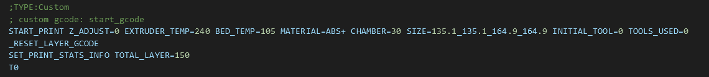
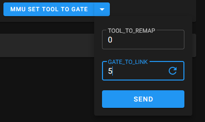
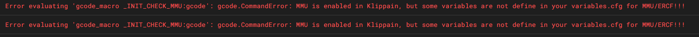
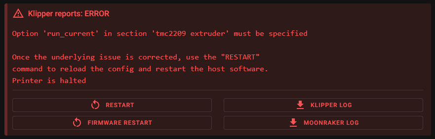
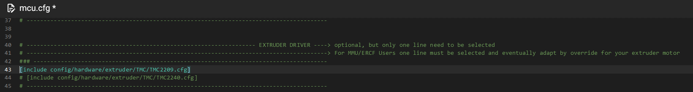

# <u>**MMU details for correct install**</u>

before installing Happy-Hare V2.2 you must

Uninstall the old ercf ERCF-Software-V3 (if you already have it):

1. backup your old ercf_***.cfg files for future reference,
1. Cleanly REMOVE ERCF-Software-V3:

```
~/ERCF-Software-V3/install.sh -u
rm -rf ~/ERCF-Software-V3
```

and install the "new" Happy Hare V2 by following instructions in <https://github.com/moggieuk/Happy-Hare>:

```
cd ~
git clone https://github.com/moggieuk/Happy-Hare.git
cd Happy-Hare

./install.sh -i
```

Finally, Klippain requires a few simple steps to configure and customize it for your printer: please follow the [configuration guide](./configuration.md).

----
‎  

# <u>**Some loose details:**</u>

- <u>**MMU check Gates on Start Print:**</u>

&nbsp;&nbsp;I recommend to set your `variable_mmu_check_gates_on_start_print` to `True` in your Klippain `variables.cfg` file.  
&nbsp;&nbsp;&nbsp;&nbsp;&nbsp;&nbsp;-> But take in mind that you also must add in your slicer start g_code the parameter `TOOLS_USED=!referenced_tools!` used by the [HHv2 moonraker gcode preprocessor](https://github.com/moggieuk/Happy-Hare/blob/main/doc/gcode_preprocessing.md). Otherwise, only the INITIAL TOOL will be checked and if the gates used have previously been marked as empty an error may occur during printing!!!

‎  
‎  

- <u>**Early check MMU errors during print_start:**</u>

  > **Warning**
  >
  > If you want MMU errors to be checked earlier, you must have set `variable_mmu_check_errors_on_start_print: True` in your klippain `variables.cfg` file ***or*** set `print_start_detection: 0` in `mmu/base/mmu_parameters.cfg`. Setting it to `True` at this time will force MMU `print_start_detection to be disabled.  

&nbsp;&nbsp;By default, with `print_start_detection: 1`, HHv2 will automatically detect start and end of print. But if an "error" occur in loading/checking MMU tools the MMU pause occur at the end of the print_start. ***So you must wait the end of start_print to debug MMU***.  
&nbsp;&nbsp; With `print_start_detection: 0` Klippain will manage the state changes of the MMU, and allows you to check early (and immediately stop the print_start) and therefore avoid having to wait for the whole process to be completed. ***But in this case you will have to restart printing after debugging the MMU***.  
&nbsp;&nbsp;&nbsp;&nbsp;&nbsp;&nbsp;-> **Personally** I recommend setting the operation with detection and stopping of print_start by setting `print_start_detection: 0` in `mmu_parameters.cfg` or by setting `variable_mmu_check_errors_on_start_print: True` in your Klippain `variables.cfg`.  
&nbsp;&nbsp;&nbsp;&nbsp;But you have the choice of the desired operating mode. Either stop print_start immediately, or wait for the process to complete and pause automatically at the end of print_start (default operating mode).  
&nbsp;&nbsp;&nbsp;-> If you define `variable_mmu_check_errors_on_start_print: True` in your Klippain `variables.cfg` file, HH's `print_start_detection` will be automatically disabled and Klippain will manage the MMU state change.  
&nbsp;&nbsp;&nbsp;-> If you define `variable_mmu_check_errors_on_start_print: False` in your Klippain `variables.cfg` file, you can choose in `mmu_parameters.cfg` how MMU state changes will be managed.

‎  
‎  

- <u>**Difference between GATE and TOOL:**</u>

&nbsp;&nbsp;The `GATE` designates the hardware MMU selector spool.  
&nbsp;&nbsp;The `TOOL` designates the software MMU tool use to call the filament by the `Tx` command.  
In HHv2, by default, GATE=TOOL. To see your current config use the `MMU_REMAP_TTG` command.  
But it's possible to remap that if you want with `MMU_REMAP_TTG TOOL=x GATE=y`, or for complete remaping (example for a 6 gates MMU to completely reverse the order of all tools): `MMU_REMAP_TTG MAP=5,4,3,2,1,0` command.  
&nbsp;&nbsp;You can use it, for exemple, if you have previously slice a print project with some tools defined in th final slicer gcode file and you want to reprint it but you have moved the colors spools to another gate or you want to make it with different colors without having to move the spools entries, or reslice your project.  
&nbsp;&nbsp;&nbsp;&nbsp;&nbsp;&nbsp;-> Here I have slice my project with default tool (T0) and import in mainsail:  
<p align="center"></p>  
and I want to use spool loaded in gate 5 instead of Gate 0: so I can use this Klippain macro: `MMU_SET_TOOL_TO_GATE TOOL_TO_REMAP=0 GATE_TO_LINK=5`:  
<p align="center"></p>  
&nbsp;&nbsp;&nbsp;&nbsp;&nbsp;&nbsp;-> For the complete description have a look at [Tool-to-Gate (TTG) mapping](https://github.com/moggieuk/Happy-Hare/blob/main/README.md#3-tool-to-gate-ttg-mapping).

‎  
‎  

- <u>**How to use bypass:**</u>

&nbsp;&nbsp;If you want to use the MMU bypass for a print you must load the filament to the extruder before start your print:  
&nbsp;&nbsp;&nbsp;&nbsp;&nbsp;&nbsp;-> First Home the MMU by running `MMU_HOME FORCE_UNLOAD=1` ;  
&nbsp;&nbsp;&nbsp;&nbsp;&nbsp;&nbsp;-> and select bypass with `MMU_SELECT_BYPASS` command ;  
&nbsp;&nbsp;&nbsp;&nbsp;&nbsp;&nbsp;-> finaly manualy insert the filament in the bowden to the extruder and load the filament to the nozzle by using `MMU_LOAD` command. You can also just insert manualy the filament in the bowden until contact with the extruder and then run the print (the `start_print` macro will try to load filament in the toolhead).  
&nbsp;&nbsp;&nbsp;&nbsp;&nbsp;&nbsp;* At the end of the print you can use the `MMU_EJECT` command to unload filament out of the extruder and then manualy unload the bowden. (Automatic if `variable_mmu_unload_on_end_print` is set to True in Klippain `variables.cfg`).  
&nbsp;&nbsp;&nbsp;&nbsp;&nbsp;&nbsp;**Rem for Spoolman users:** you can set in your slicer start_print gcode the `INITIAL_TOOL` parameter for your filament so klippain use it to activate the correct Spoolman spool...

‎  
‎  

- <u>**HHv2 and Spoolman user:**</u>

&nbsp;&nbsp;HHv2 natively handles spool change in Spoolman. To do this, you must activate Spoolman support and configure the spool IDs in HHv2 `mmu_parameters.cfg`:  
&nbsp;&nbsp;&nbsp;&nbsp;&nbsp;&nbsp;&nbsp;&nbsp;&nbsp;&nbsp;&nbsp;&nbsp;&nbsp;-> `enable_spoolman:1`  
&nbsp;&nbsp;&nbsp;&nbsp;&nbsp;&nbsp;&nbsp;&nbsp;&nbsp;&nbsp;&nbsp;&nbsp;&nbsp;-> `gate_spool_id:` or use HH macro: `MMU_GATE_MAP GATE=n SPOOLID=id`. You can also use Klippain macro `MMU_SET_GATE_ID` with `GATE` and `SPOOL_ID` parameters (eg: `MMU_SET_GATE_ID GATE=5 SPOOL_ID=12` to define Spoolman spool_ID 12 on MMU gate 5).  

‎  
‎  

- <u>**Some error message exemples:**</u>

<p align="center"></p>  
<details>
<summary><sub>🔸 Read more about this error...</sub></summary>

&nbsp;&nbsp;If you have this message at bootup in the console you must check your Klippain variables in `variables.cfg` !!!

    - variable_mmu_force_homing_in_start_print: True or False
    - variable_mmu_unload_on_cancel_print: True or False
    - variable_mmu_unload_on_end_print: True or False
    - variable_mmu_check_gates_on_start_print: True or False
    - variable_mmu_check_errors_on_start_print: True or False

</details>

‎  
‎  
----

<p align="center"></p>  
<details>
<summary><sub>🔸 Read more about this error...</sub></summary>

&nbsp;&nbsp;If the gate is "correctly" loaded and this error appears, this is generally due to the fact that the gate was previously marked as empty and its state has not been updated.
To correct during print for example you can use the command: `MMU_GATE_MAP GATE=1 AVAILABLE=1` (adapt for your GATE number...)

&nbsp;&nbsp;A good practice is to check the gates state after make changes in filaments with the command `MMU_GATE_MAP` to be sure all your setup is correct.  
The command `MMU_CHECK_GATE` can update the MAP for all MMU gates. But you can also use for exemple `MMU_CHECK_GATE TOOLS=0,2,5` to check and update only tools 0, 2 and 5 or `MMU_CHECK_GATE GATES=0,2,5` to check and update only gates 0, 2 and 5.

</details>

‎  
‎  
----

<p align="center"></p>  
<details>
<summary><sub>🔸 Read more about this error...</sub></summary>

&nbsp;&nbsp;After installing HHv2 or upgrade it if you have this error, you must check and modify your Klippain `mcu.cfg` file to uncomment the correct line in the EXTRUDER DRIVER section:

<p align="center"></p>

</details>

----
